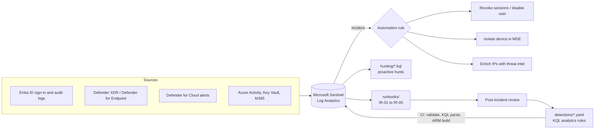

# Azure SecOps Toolkit

**Detection-as-code, SOAR playbooks, threat hunting and incident runbooks for Microsoft Sentinel, Microsoft Defender XDR, Defender for Cloud and Entra ID.**

[](https://github.com/nazsam/azure-secops-toolkit/actions/workflows/ci.yml)


A working reference implementation of the day-to-day security operations workflow in an Azure enterprise:
monitor, detect, hunt, respond, and improve. Everything is code, reviewed in pull requests and validated in CI
before it reaches the SOC.



## What is inside

| Folder | What it covers |
|---|---|
| [`detections/`](detections) | 11 Sentinel scheduled analytics rules (KQL) with MITRE ATT&CK mapping and entity mappings: password spray, multi-country sign-in, privileged role assignment, MFA removal, app credential persistence, encoded PowerShell, LSASS dumping, NSG exposure, Key Vault secret harvesting, Defender for Cloud alert clusters, mass file download |
| [`hunting/`](hunting) | 6 threat hunting queries: legacy auth, risky OAuth consent, public RDP, Office spawning script hosts, threat intelligence IP matches, dormant accounts |
| [`playbooks/`](playbooks) | 3 SOAR playbooks (Logic Apps, managed identity): revoke Entra ID sessions and disable user, isolate a device in Defender for Endpoint, enrich IPs with AbuseIPDB |
| [`runbooks/`](runbooks) | Incident runbooks for compromised identity, phishing, malware and ransomware, Azure resource abuse and critical vulnerabilities, plus a post-incident review template and a tabletop exercise |
| [`infra/`](infra) | Bicep: Log Analytics + Sentinel onboarding, Defender for Cloud plans, Activity log to Sentinel |
| [`src/secops/`](src/secops) | Python CLI: rule validation, ARM compilation, MITRE coverage report, IOC extraction to Sentinel watchlists, risk-based vulnerability prioritisation with SLAs |
| [`tools/KqlValidator/`](tools/KqlValidator) | C# tool that syntax-checks every query with Microsoft's official Kusto parser |
| [`sql/`](sql) | T-SQL for vulnerability SLA compliance and MTTR reporting (Azure SQL / SQL Server) |
| [`postman/`](postman) | Postman collection for Microsoft Graph Security, Defender for Endpoint and Sentinel REST APIs |
| [`docs/mitre-coverage.md`](docs/mitre-coverage.md) | Auto-generated ATT&CK coverage matrix |

## Quick start

```bash
pip install -e ".[dev]"

secops validate                         # check every analytics rule
secops build-arm                        # compile rules to build/analytics-rules.json
secops coverage                         # regenerate docs/mitre-coverage.md
secops ioc threat-report.txt --source "vendor-report" > watchlist.csv   # defanged IOCs to a Sentinel watchlist
secops vuln defender-export.csv         # prioritise findings and assign remediation SLAs
```

Deploy to a resource group:

```bash
az deployment sub create -l canadacentral -f infra/subscription.bicep -p workspaceId=<workspace resource id>
az deployment group create -g rg-secops -f infra/sentinel.bicep -p workspaceName=law-secops
az deployment group create -g rg-secops -f build/analytics-rules.json -p workspaceName=law-secops
```

Or run the **Deploy to Azure** workflow (GitHub Actions with OpenID Connect, no stored secrets) or the included
[`azure-pipelines.yml`](azure-pipelines.yml) for Azure DevOps.

## Detection engineering workflow

1. Write or tune a rule in `detections/` (same YAML shape as the public Azure-Sentinel repository).
2. Open a pull request. CI runs: unit tests, rule schema validation (severity, tactics, technique IDs, entity
   identifiers, query window limits), the official Kusto parser on every query, ARM compilation, and a check that
   the ATT&CK coverage page is current.
3. Merge. The deploy workflow pushes the compiled ARM template to the Sentinel workspace.
4. Incidents from the rule trigger automation rules and playbooks; analysts follow the matching runbook.
5. The post-incident review feeds tuning and new detections back into step 1.

## Vulnerability prioritisation

`secops vuln` scores each finding 0 to 100 on CVSS, exploit availability, internet exposure and asset
criticality, then assigns P1 (7 days) to P4 (90 days) SLAs and flags overdue items. Load the output into
`sql/vulnerability_reporting.sql` for weekly SLA compliance and mean-time-to-remediate reporting.

## Requirements

Microsoft Sentinel workspace with the Entra ID, Microsoft Defender XDR, Defender for Cloud, Azure Activity,
Microsoft 365 and Key Vault (diagnostic settings) data connectors. Detection thresholds are starting points:
tune them to your tenant's baseline before enabling automatic response.

## About

Built and maintained by **Sam Naz**, Cybersecurity and AI Architect.
[LinkedIn](https://www.linkedin.com/in/samicybersecurity) · Released under the [MIT License](LICENSE).
